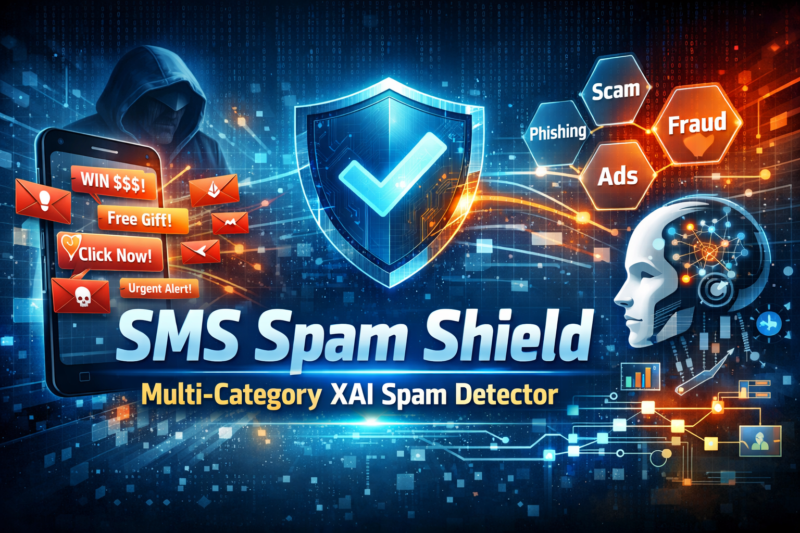

# SMS Spam Shield: Multi-Category XAI Spam Detector

[](https://python.org)
[](https://fastapi.tiangolo.com)
[](https://tensorflow.org)
[](LICENSE)



An intelligent, explainable SMS spam detection system that classifies messages into **spam, phishing, promotional, and legitimate** categories using machine learning and explainable AI (XAI). Developed as a project for the Artificial Intelligence (CMP 346) course at Cosmos College of Management & Technology.

---

## 📋 Table of Contents
- [Project Overview](#-project-overview)
- [Features](#-features)
- [Team & Supervision](#-team--supervision)
- [Tech Stack](#-tech-stack)
- [Repository Structure](#-repository-structure)
- [Installation](#-installation)
- [Quick Start](#-quick-start)
- [Training Models](#-training-models)
- [API Reference](#-api-reference)
- [Frontend Features](#-frontend-features)
- [Testing](#-testing)
- [Documentation](#-documentation)
- [License](#-license)
- [Acknowledgements](#-acknowledgements)

---

## 🎯 Project Overview

SMS Spam Shield is a multi-category spam detection system designed to provide **accurate** and **interpretable** SMS classification. It combines classical machine learning (Logistic Regression, Naive Bayes, SVM) with a deep learning model (LSTM with attention) to categorize messages. Explainability is provided via **token-level explanations** using SHAP (for SVM) and attention weights (for LSTM). The system features a responsive web interface with real-time predictions, model comparison, and a monitoring dashboard.

This project was developed incrementally over four phases, each adding a new model and enhanced capabilities. The final ensemble achieves **97.1% accuracy** on the test dataset.

---

## ✨ Features

- **Multi-Category Classification**: Spam, Phishing, Promotional, Legitimate
- **Four ML Models**: Logistic Regression, Naive Bayes, SVM (tuned), LSTM with attention
- **Explainable AI**: 
  - SHAP explanations for SVM
  - Attention-based explanations for LSTM
  - Token-level importance highlighting
- **Ensemble Learning**: Combine predictions via weighted voting or probability averaging
- **Real-time Predictions**: Fast inference (<100ms per SMS)
- **Interactive Dashboard**: Monitor prediction throughput, model performance, and category distribution
- **Model Versioning**: Track and rollback model versions with production/staging tags
- **Comprehensive API**: RESTful endpoints with OpenAPI documentation
- **Responsive UI**: Built with Bootstrap 5, Chart.js, and custom animations

---

## 👥 Team & Supervision

| Name | Roll Number | Role |
|------|-------------|------|
| Alok Kumar Jha | 230302 | Frontend & UI/UX |
| Bibek Kumar Jha | 230310 | Backend |
| Kushal Prasad Joshi | 230345 | ML, System Architecture & Integration |

**Supervisor**: Er. Ranjan Raj Aryal  
**Course**: Artificial Intelligence (CMP 346)  
**Institution**: Cosmos College of Management & Technology (Affiliated to Pokhara University), Sitapaila, Kathmandu, Nepal

---

## 🛠 Tech Stack

- **Backend**: FastAPI, Uvicorn, Python 3.10
- **Machine Learning**: Scikit-learn, TensorFlow/Keras, NLTK, SHAP
- **Frontend**: HTML5, CSS3, JavaScript, Bootstrap 5, Chart.js, Font Awesome
- **Database**: None (stateless; local storage for history)
- **Deployment**: Docker, Uvicorn (with optional Prometheus monitoring)

---

## 🔧 Installation

### Prerequisites
- Python 3.9 or 3.10 (64-bit)
- Git
- (Optional) Docker for containerized deployment

### Clone and Setup
```bash
git clone https://github.com/kushalprasadjoshi-bachelor/sms-spam-shield.git
cd sms-spam-shield
python -m venv venv
source venv/bin/activate      # On Windows: venv\Scripts\activate
pip install -r backend/requirements/base.txt
```

For development, install additional dependencies:
```bash
pip install -r backend/requirements/dev.txt
```

For all the requirements at once:
```bash
pip install -r requirements.txt
```

### Configuration
Copy `.env.example` to `.env` and update paths as needed:
```bash
cp .env.example .env
```

---

## 🚀 Quick Start

1. **Place your dataset** at `dataset/processed_dataset.csv` (columns: `message_text`, `category`) if you have your own dataset.
2. **Train all models**:    If you want to use the pretrained models no need to run the command below to train new models. Pretrained models will work fine.
   ```bash
   python scripts/train_model.py all
   ```

3. **Start the server**:
   ```bash
   cd backend
   uvicorn app.main:app --reload
   ```
4. **Open the app** at [http://localhost:8000](http://localhost:8000)
5. **Explore API docs** at [http://localhost:8000/api/docs](http://localhost:8000/api/docs)

---

## 🧠 Training Models

You can train individual models or all at once:

```bash
# Logistic Regression (Increment 1)
python scripts/train_model.py lr --force

# Naive Bayes (Increment 2)
python scripts/train_model.py nb --force

# SVM with hyperparameter tuning (Increment 3)
python scripts/train_model.py svm --force --tune

# LSTM with optional pre-trained embeddings (Increment 4)
python scripts/train_model.py lstm --force [--use-pretrained]

# Train all models
python scripts/train_model.py all
```

After training, models are stored in the `models/` directory with versioning.

---

## 📡 API Reference

Base URL: `/api/v1`

| Endpoint | Method | Description |
|----------|--------|-------------|
| `/predict` | POST | Classify an SMS with selected models |
| `/ensemble` | POST | Ensemble prediction with method selection |
| `/models` | GET | List loaded models and their metrics |
| `/compare` | POST | Compare predictions from all loaded models |
| `/dashboard` | GET | Real-time monitoring data |
| `/health` | GET | Health check |

Example prediction request:
```json
POST /api/v1/predict
{
  "sms": "Congratulations! You won a free iPhone.",
  "models": ["lr", "svm", "lstm"],
  "include_explanation": true
}
```

---

## 🎨 Frontend Features

- **Chat Interface**: Type an SMS and see results in a conversational style.
- **Model Selection**: Toggle individual models on/off.
- **Confidence Visualization**: Progress bars and pie charts.
- **Explanation Highlights**: Important words are color-coded.
- **Comparison Modal**: View side-by-side model predictions.
- **Monitoring Dashboard**: Real-time charts of throughput and model usage.
- **Dark Mode**: Toggle between light and dark themes.

---

## 🧪 Testing

Run backend tests with:
```bash
cd backend
pytest
```

Test API endpoints manually with curl or Postman.

---

## 📄 Documentation

- [Project Proposal](docs/proposal/proposal.pdf)
- [Project Report](docs/report/report.pdf)

- [API Documentation](http://localhost:8000/api/docs) (when server running)

---

## 📝 License

**All Rights Reserved** © 2026 Cosmos College of Management & Technology.

This project is developed for academic purposes as part of the Artificial Intelligence (CMP 346) course. Unauthorized reproduction, distribution, or commercial use is prohibited without written permission from the college and the project authors.

More information is available in [LICENSE](LICENSE) file.

---

## 🙏 Acknowledgements

- **Er. Ranjan Raj Aryal** for invaluable guidance and supervision.
- **Cosmos College of Management & Technology** for providing resources and support.
- **OpenAI's ChatGPT** for assistance in drafting documentation and code refinement.
- The open-source community for libraries like FastAPI, Scikit-learn, TensorFlow, and Bootstrap.

---

*Built with ❤️ for AI (CMP 346) Practicals*
